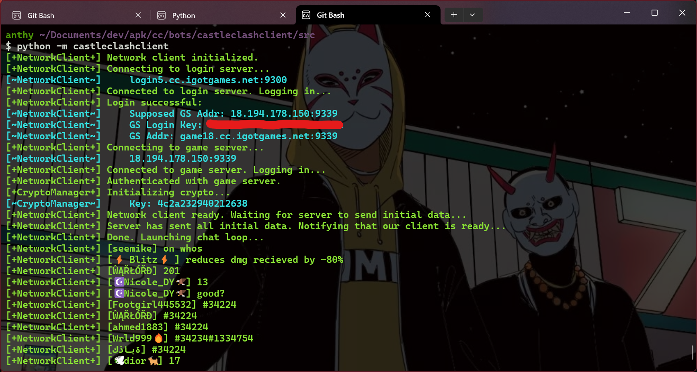

# CastleClashClient (v3.8.9)

**Table of Contents**

- [Installation](#installation)
- [License](#license)

## Installation

```console
git clone https://github.com/yntha/CastleClashClient.git
```

## Usage



For now, it's just a simple client to view the broadcast chat channel. I might add more in the future, maybe even the ability to farm your own account, but no promises.

```bash
cd CastleClashClient/src
python -m castleclashclient
```

## Obtaining your User ID and Access Key

1. Install [PCAPdroid](https://github.com/emanuele-f/PCAPdroid) on your phone.
2. Open PCAPdroid, and under target apps, select Castle Clash (com.igg.castleclash).
3. Press the start button, and launch Castle Clash for a minute or two.
4. Come back to PCAPdroid and press the stop button.
5. In the Connections tab, find the connection to the login server, which should be using port 9300. Additionally, the hostname for the login server is in the format `loginX.cc.igotgames.net`, where `X` is the server number.
6. In the Payload tab, you'll see a list of packets and their hex dump. Click the download button on the first packet and save it as "Raw Bytes".
7. Assuming you have termux installed and have installed the python package, run the [gen_config.py](gen_config.py) to generate a config file. Be sure to pass the path to the raw bytes file you just saved.

    7a. Optionally, if you prefer to do this on a pc, just upload the raw bytes file to your pc and run the script there.
8. The script will update the config file with your user id and access key.
